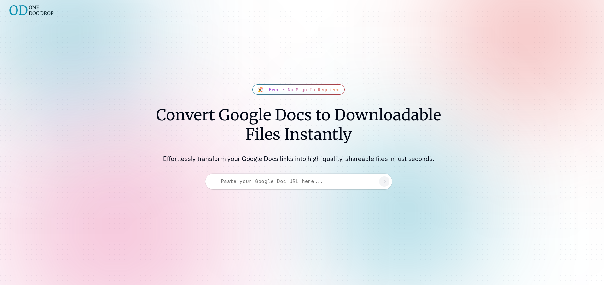

# One Doc Drop

A modern web application for downloading Google Docs in various formats. Simply paste your Google Docs URL and download your document in the format you need.

## 🌐 Live Demo

Check out the live demo here: [One Doc Drop](https://mouadbt.github.io/One-Doc-Drop/)

## 📸 Screenshot



## ✨ Features

- 📋 Easy Google Docs URL input
- 📥 Multiple download format support
- 🎨 Clean, modern UI with Tailwind CSS
- ⚡ Fast and responsive
- 🔄 Real-time feedback

## 🛠️ Tech Stack

- **React** - UI library
- **Vite** - Build tool and dev server
- **Tailwind CSS** - Utility-first CSS framework
- **shadcn/ui** - Reusable UI components
- **Framer Motion** - Animation library
- **Lucide Icons** - Beautiful icons

## 🚀 Getting Started

### Prerequisites

- Node.js (v18 or higher)
- npm or yarn

### Installation

1. Clone the repository:
   ```bash
   git clone <repository-url>
   cd Download-google-docs
   ```

2. Install dependencies:
   ```bash
   npm install
   ```

3. Start the development server:
   ```bash
   npm run dev
   ```

4. Open your browser and navigate to `http://localhost:5173`

## 📦 Available Scripts

- `npm run dev` - Start the development server
- `npm run build` - Build for production
- `npm run preview` - Preview the production build
- `npm run lint` - Run ESLint
- `npm run deploy` - Deploy to GitHub Pages

## 📝 License

This project is open source and available under the [MIT License](LICENSE).

## 🙏 Acknowledgments

- [React](https://react.dev/)
- [Vite](https://vitejs.dev/)
- [Tailwind CSS](https://tailwindcss.com/)
- [shadcn/ui](https://ui.shadcn.com/)
- [Framer Motion](https://www.framer.com/motion/)
