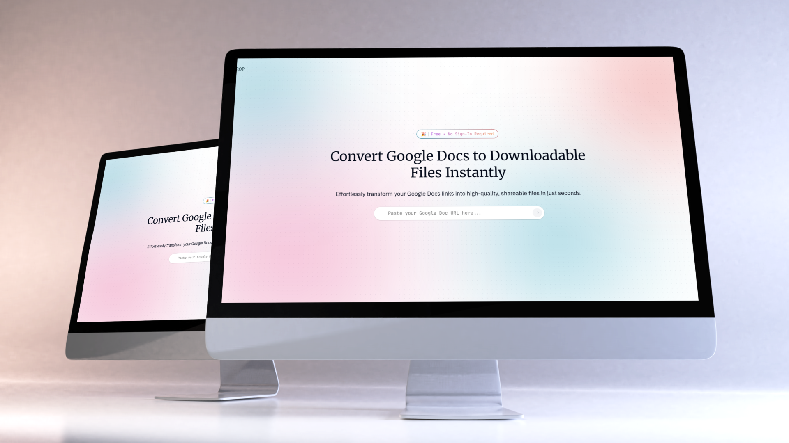
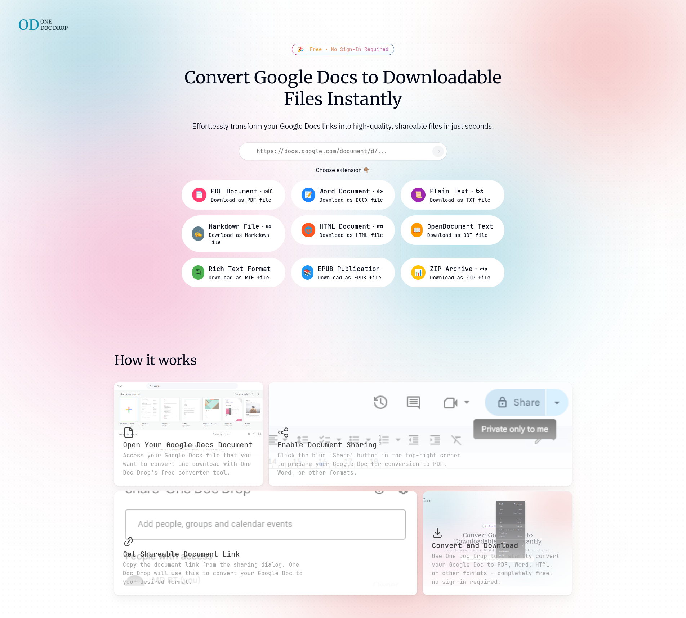
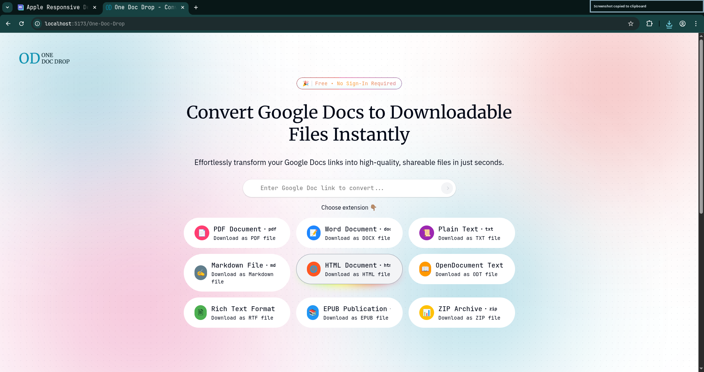

# One Doc Drop


A modern web application for downloading Google Docs in various formats. Simply paste your Google Docs URL and download your document in the format you need.



> [!IMPORTANT]
> **Note:** To be able to download documents, you must be logged in to your Google account in the current browser session.

## Table of Contents
- [Screenshots](#screenshots)
- [Features](#features)
- [Tech Stack](#tech-stack)
- [Getting Started](#getting-started)
- [Available Scripts](#available-scripts)
- [License](#license)
- [Acknowledgments](#acknowledgments)

## Screenshots






## ✨ Features

- 📋 **Easy Input**: Simply paste your Google Docs URL.
- 📥 **Format Variety**: Support for multiple download formats.
- 🎨 **Modern UI**: Clean interface built with Tailwind CSS and shadcn/ui.
- ⚡ **Performance**: Fast and responsive user experience powered by Vite.
- 🔄 **Real-time Feedback**: Immediate status updates during the download process.

## 🛠️ Tech Stack

- **React** - UI library
- **Vite** - Build tool and dev server
- **Tailwind CSS** - Utility-first CSS framework
- **shadcn/ui** - Reusable UI components
- **Framer Motion** - Animation library
- **Lucide Icons** - Beautiful icons

## 🚀 Getting Started

### Prerequisites

- Node.js (v18 or higher)
- npm or yarn

### Installation

1. Clone the repository:
   ```bash
   git clone https://github.com/mouadbt/Download-google-docs.git
   cd Download-google-docs
   ```

2. Install dependencies:
   ```bash
   npm install
   ```

3. Start the development server:
   ```bash
   npm run dev
   ```

4. Open your browser and navigate to `http://localhost:5173/One-Doc-Drop`

## 📦 Available Scripts

- `npm run dev` - Start the development server
- `npm run build` - Build for production
- `npm run preview` - Preview the production build
- `npm run lint` - Run ESLint
- `npm run deploy` - Deploy to GitHub Pages

## 📝 License

This project is open source and available under the [MIT License](LICENSE).

## 🙏 Acknowledgments

- [React](https://react.dev/)
- [Vite](https://vitejs.dev/)
- [Tailwind CSS](https://tailwindcss.com/)
- [shadcn/ui](https://ui.shadcn.com/)
- [Framer Motion](https://www.framer.com/motion/)
